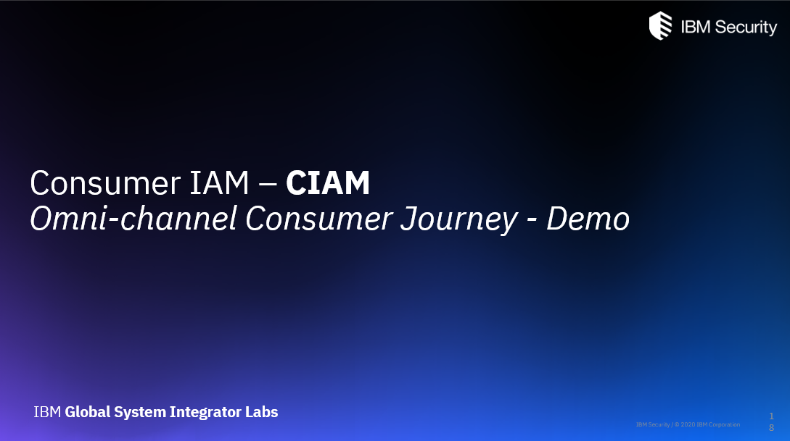

# tmiMobileApp - Contents

- [**Introduction**](#introduction)
  - [Usecases](#usecases)
  - [Recorded Demo Video](#recorded-demo-video)

- [**App Setup as a Demo User**](#demo-user)
  - [Pre-requisites](#demo-pre-requisites)
    <!--- [TrustMeInsurance WebApp setup](#trustmeinsurance-webapp-setup)--->
  - [IBM Verify IDaaS setup](#ibm-verify-idaas-tenant-setup)
  - [Mobile setup](#mobile-setup)
  - [Running the demo](#running-the-demo)

- [**Contributing as a Developer**](#developer)
  - [Pre-requisites](#development-pre-requisites)
  - [Setup Android Studio](#setup-android-studio)
  - [IBM Verify IDaaS tenant setup](#ibm-verify-idaas-tenant-setup)
  - [Testing & Debugging](#testing--debugging)

<!---- [**Verify SDK & APIs Usage**](#verify-sdk--apis-usage)
  - [Login page](#login-page)
  - [Profile page](#profile-page)
  - [Quote & Policy pages](#quote--policy-pages)--->

## Introduction
**CIAM - Consumer Identity and Access Management** is key focus areas by many enterprises/brands in their digital transformation journey. **IBM Security Verify IDaaS**, being market leader in CIAM space, helps to develop best consumer experiences in their channel applications. This code-pattern will explain in detail how to leverage Verify IDaaS and SDK/APIs to develop a Mobile App to create best *omni-channel consumer experiences* by having features like password-less login, social login & ease of consents and preferences management and bringing transparency while processing PI data so on.

### Usecases

| Login  | Profile | Quote & Policy |
|---|---|---|
|Normal login|Self care|Consent usage for PI data processing|
|Social login|Consent recordings|Strong MFA - Push verfication|
|QR login|MFA enroll/de-enroll|---|
|Forgot passsword|Change password|---|
||||

### Recorded Demo Video
[](https://ibm.box.com/s/1tdt7jvkvgcpo840bdy0430lt2061qkw)

## Demo User

### Demo Pre-requisites

   + __TrustMeInsurance WebApp setup__

     TrustMeInsurance WebApp is needed for Omni channel consumer journey.
     <br/>This [link](https://github.ibm.com/gsi-isv/ciam-demo.git) will take you to the TrustMeInsurance WebApp Github repository.

   + __Phone OR Android Studio Emulator__

     Make sure the phone or emulator size is in between 5.5 to 6.5 inches.
     <br/> If you want to use the emulator for the demo follow the below steps (You can skip the steps if you are using phone for the demo)
     - Click [here](https://developer.android.com/studio/install) and follow the given steps for installing android studio.
     - Click [here](https://developer.android.com/studio/run/managing-avds) and follow the given steps for creating emulator.

   + __IBM Security Verify Tenant__

     Click [here](https://www.ibm.com/account/reg/us-en/signup?formid=urx-30041) to get IBM Security Verify free trial


### IBM Verify IDaaS setup
Click [here](docs/Verify_IDAAS_Setup.md) to get instructions to setup IBM Verify IDaaS

### Mobile setup
Click [here](docs/User_Mobile_Setup.md) to setup Mobile device

### Running the demo
Click [here](docs/Running_Demo.md) to get instructions to run the demo

## Developer

### Development Pre-requisites

   + __Android Studio__

     Click [here](https://developer.android.com/studio/install) and follow the given steps for installing android studio.

   + __Android Studio Emulator__

     Click [here](https://developer.android.com/studio/run/managing-avds) and follow the given steps for creating emulator.

   + __IBM Security Verify Tenant__

     Click [here](https://www.ibm.com/account/reg/us-en/signup?formid=urx-30041) to get IBM Security Verify free trial

   + __TrustMeInsurance WebApp setup__

     This [link](https://github.ibm.com/gsi-isv/ciam-demo.git) will take you to the TrustMeInsurance WebApp Github repository.

### Setup Android Studio
Click [here](docs/Android_Studio_Setup.md) to get instructions to setup Android Studio for mobile app development

### IBM Verify IDaaS tenant setup
Click [here](docs/Verify_IDAAS_Setup.md) to get instructions to setup IBM Verify IDaaS

### Testing & Debugging
- For testing related details click [here](https://developer.android.com/training/testing)
- For debugging related details click [here](https://developer.android.com/studio/debug)


# License

The contents of this repository are open-source under the Apache 2.0
licence.

```
Copyright 2020 International Business Machines

Licensed under the Apache License, Version 2.0 (the "License");
you may not use this file except in compliance with the License.
You may obtain a copy of the License at

    http://www.apache.org/licenses/LICENSE-2.0

Unless required by applicable law or agreed to in writing, software
distributed under the License is distributed on an "AS IS" BASIS,
WITHOUT WARRANTIES OR CONDITIONS OF ANY KIND, either express or implied.
See the License for the specific language governing permissions and
limitations under the License.
```

