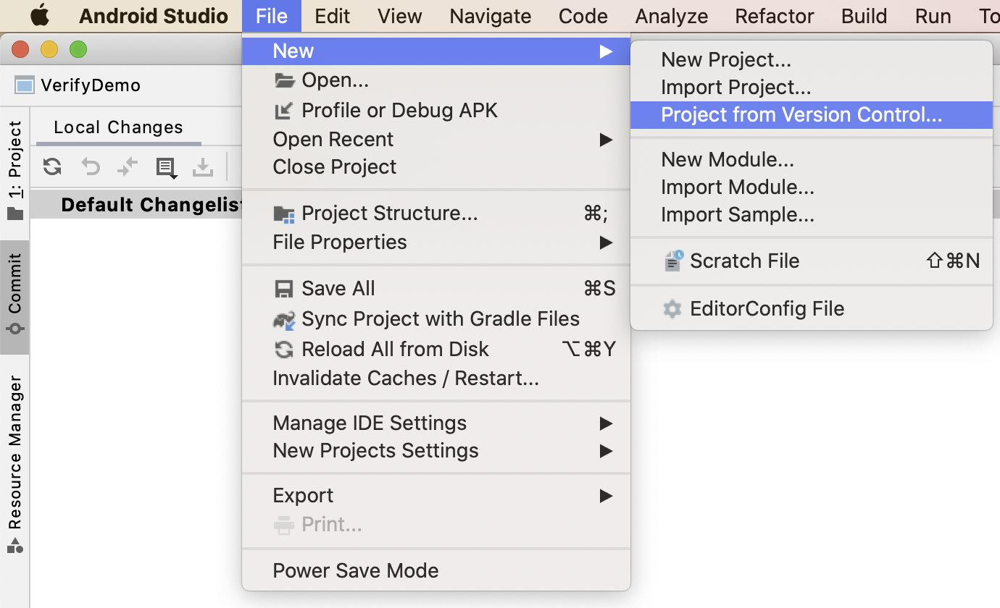
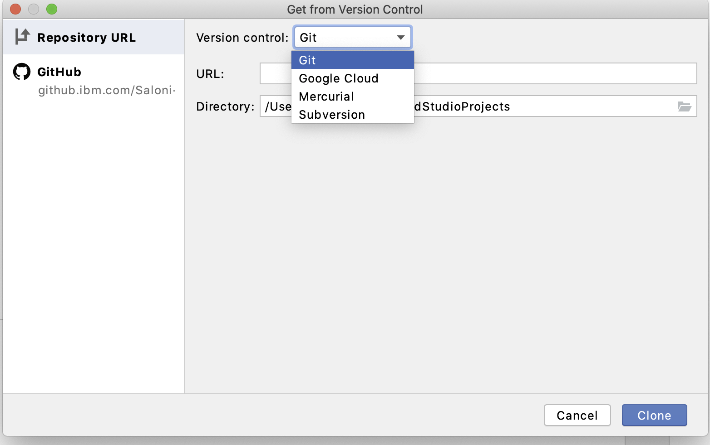
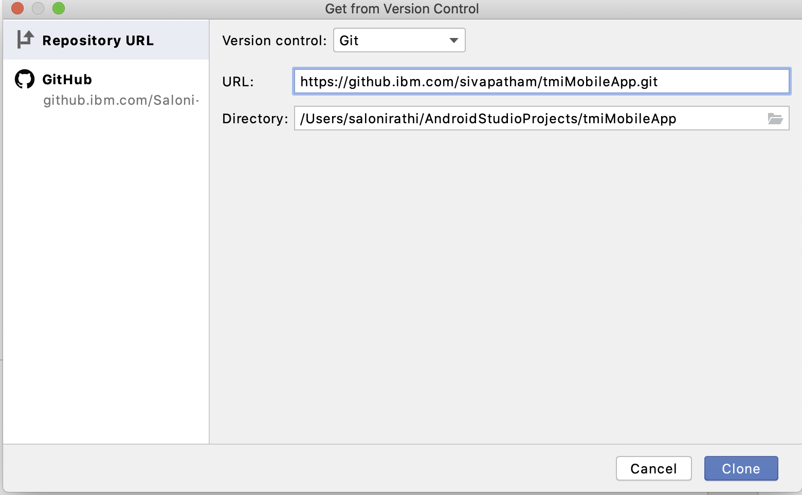
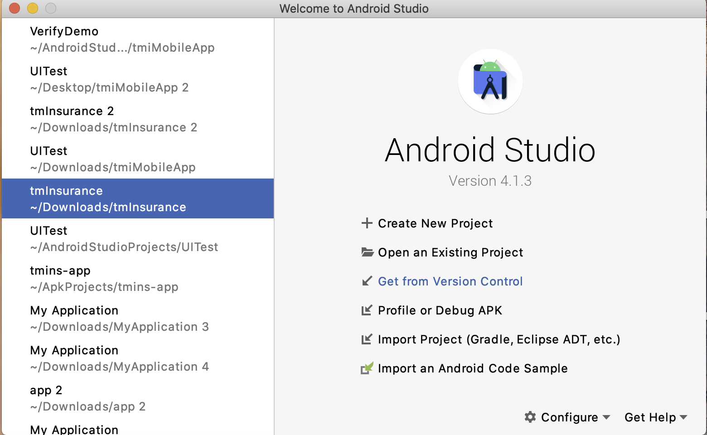
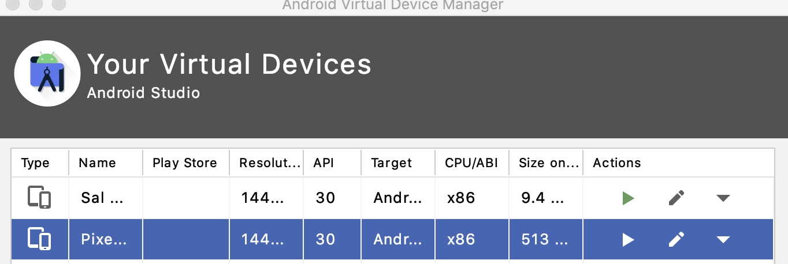
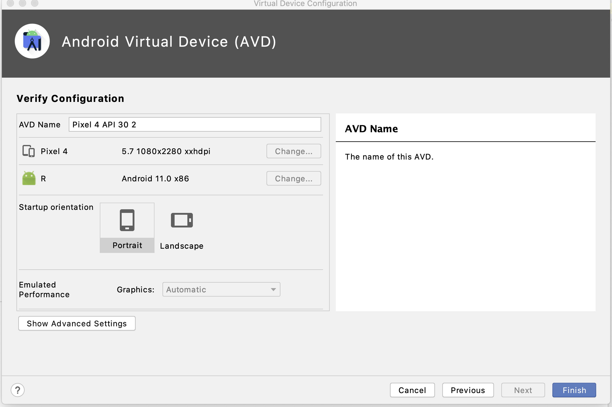
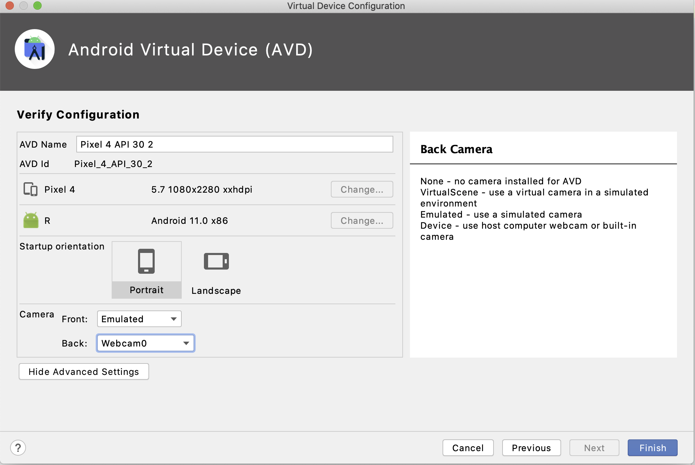

# tmiMobileApp - Android Studio Setup

## Install Android Studio
Click [here](https://developer.android.com/studio/install) to install android studio.

## Setup GitHub project

### Clone Trust Me Insurance Android Project from GitHub in Android Studio
Get the Trust Me Insurance Android project from [here](https://github.ibm.com/sivapatham/tmiMobileApp.git)
<br/>
#### Method I
1. Open your Android Studio then go to the File > New > Project from Version Control as shown in the below image. <br/><br/>
<br/><br/>
2. After clicking on the Project from Version Control a pop-up screen will arise like below. In the Version control choose Git from the drop-down menu.<br/><br/>
<br/><br/>
3. Then at last paste the link in the URL and choose your Directory. Click on the Clone button and you are done.<br/><br/>
<br/><br/>

#### Method II
1. Click on the Get from Version Control. <br/><br/>
<br/><br/>
2. In the Version control choose Git from the drop-down menu.<br/><br/>
<br/><br/>
3. Then at last paste the link in the URL and choose your Directory. Click on the Clone button and you are done.<br/><br/>
<br/><br/>

### Upload Project on GitHub from Android Studio
You can get all steps [here](https://www.geeksforgeeks.org/how-to-upload-project-on-github-from-android-studio/)

## Setup Emulator in Android Studio
1. Click [here](https://developer.android.com/studio/run/managing-avds) and create an emulator/virtual device using AVD manager.<br/><br/>
   **Note : Make sure the virtual device has Play Store. Some pixel models have Play Store by default. - e.g. Pixel 4. For some versions you need to do some configurations and install. While creating a virtual device if you can see a play store icon next to the model name of the phone then it has play store by default.** <br/><br/>
   <br/><br/>
   Make sure the virtual device has back camera as webcam0 selected : </br>
   1. Go to AVD Manager -> Click on Edit icon next to your virtual device-> Click on Show Advanced Settings <br/><br/>
      <br/><br/>
   2. Select Back Camera: Webcam0 <br/><br/>
      <br/><br/>

## Launch tmiMobileApp in Emulator
Follow the steps [here](https://developer.android.com/studio/run/emulator) to run Trust Me Insurance app in the emulator.

## Install and Configure IBM Security Verify App in Emulator
1. Follow the steps [here](User_Mobile_Setup.md#install-ibm-security-verify-app-using-play-store) to install IBM Security Verify app.
2. Configure IBM Security Verify app using this [link](Verify_IDAAS_Setup.md#configure-ibm-security-verify-app)

## Setup within tmiMobileApp
You can do a setup within tmiMobileApp using this [link](User_Mobile_Setup.md#setup-within-tmimobileapp)<!-- @IGNORE PREVIOUS: anchor -->


```

