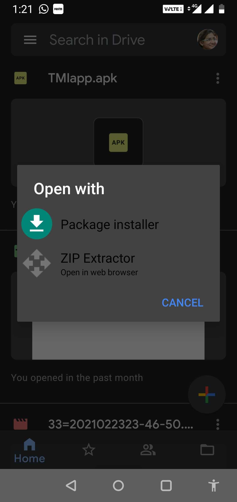
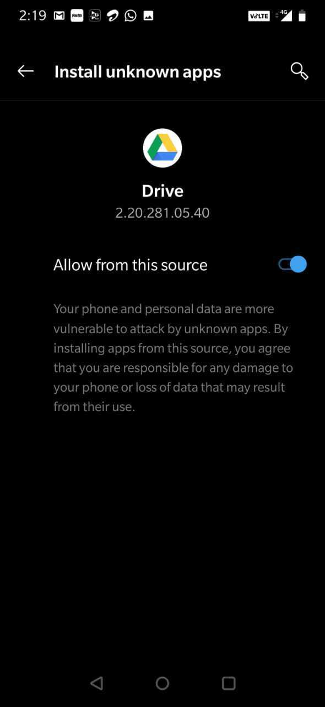
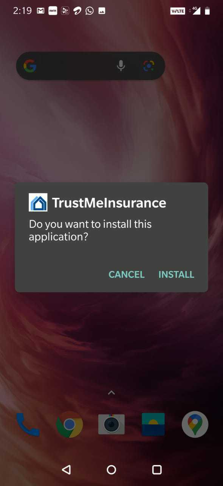
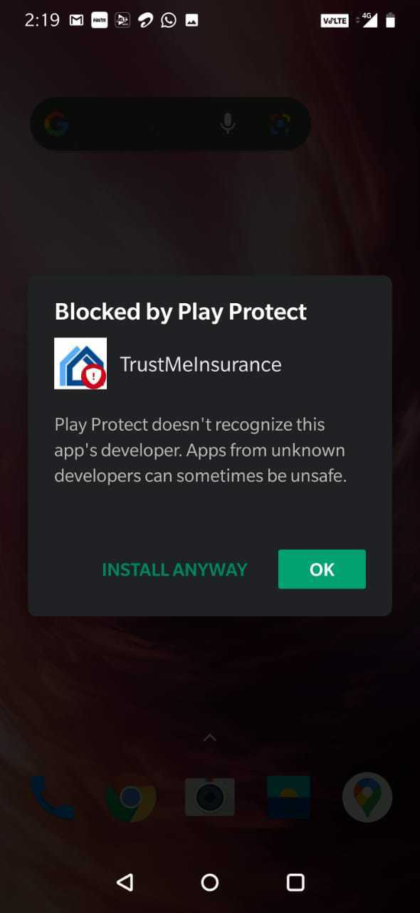
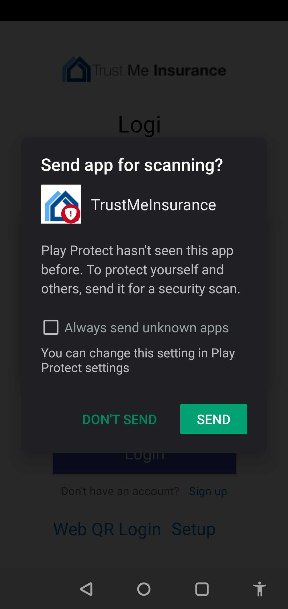
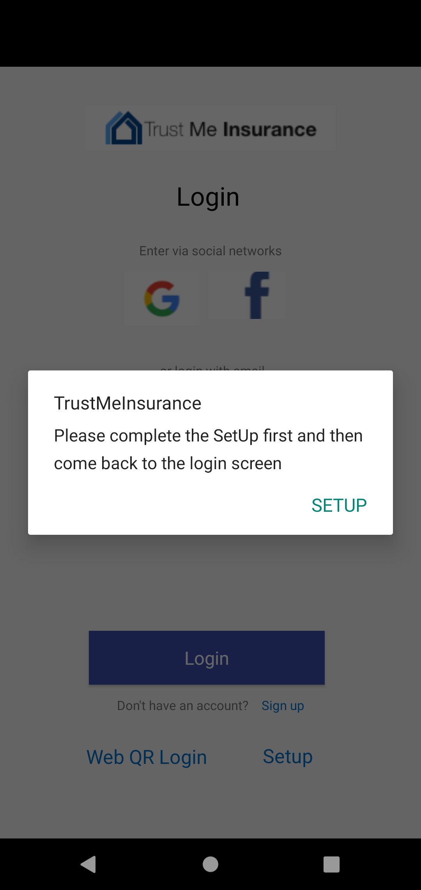
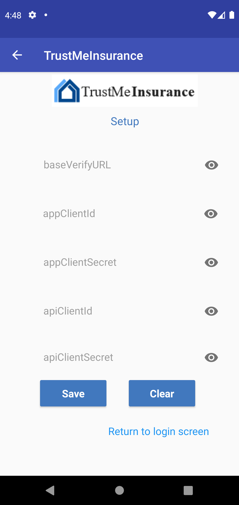

# tmiMobileApp - Mobile Setup

## Install tmiMobileApp using APK file
### Install tmiMobileApp APK file on phone
1. Open the .apk file with Package installer   
      
2. You need to give permissions to use the app from unknown resources. Click on Settings.  
       
3.  Enable allow from this source.  
       
4.  You will get a dialog box asking whether you want to install this app. Click on Install.  
      
5.  Next click on Install Anyway.   
      
6.  Next click on Don’t Send.  
      

### Install tmiMobileApp APK file on emulator
1. Click [here](https://developer.android.com/studio/install) and follow the given steps for installing android studio.
2. Click [here](https://developer.android.com/studio/run/managing-avds) and follow the given steps for creating emulator.
3. Click [here](https://developer.android.com/studio/run/emulator) and follow the given steps for running emulator.
4. Once your device is up and running just drag and drop the .apk file onto the emulator screen. An APK Installer dialog appears. When the installation completes, you can view the app in your apps list.

## Install IBM Security Verify App using Play Store
1. You can find IBM Security Verify app [here](https://play.google.com/store/apps/details?id=com.ibm.security.verifyapp&hl=en_IN&gl=US)
2. Sign in with your Gmail id with Google play
4. Click on Install
5. Click on Open
6. Read the Terms and Conditions and click on Agree
7. Read the Privacy Policy and click on Done.

## Setup within tmiMobileApp
After launching the app it will ask you to do Setup for the very first time.
 
1. Click on Setup   
      
2. You will be taken to the Setup screen. For the setup you need the following details :  
     
   1. **BaseVerifyURL**  
      At the time of creating IBM Security Verify tenant you get BaseVerifyURL. Click [here](https://www.ibm.com/account/reg/us-en/signup?formid=urx-30041) to create tenant.  
   2. **Application Client ID and Application Client Secret**  
      Go [here](Verify_IDAAS_Setup.md#app-configuration) and follow the steps.  
   3. **API Client ID and API Client Secret** 
      Go [here](Verify_IDAAS_Setup.md#api-client-configuration) and follow the steps.  
3. Enter all the details on the Set up screen and click on Save -> Go to login screen

