# tmiMobileApp - IBM Verify IDaaS Setup

## App Configuration
Login to your Cloud Identity tenant administrator console as an administrator.
 
1. Go to Applications menu and click Add application
2. Select Custom Application and click Add application
3. Complete name, description, and company name (values don't matter)
4. On Sign-in tab:
   1. Sign-on Method: Open ID Connect 1.0
   2. Application URL: http://com.ibm.verifydemo  
   **( Note : The URL can vary depending on the machine ip or machine hostname)**
   3. Grant Types : Select Authorization code, Implicit , Device flow and Resource owner password credentials (ROPC)
   4. Clear: Require proof key code exchange (PKCE) verification
   5. User Consent: Do not ask for consent
   6. Re-direct URIs: oidc://callback  
   **(Note : The Re-direct URL can vary depending on the machine ip or machine hostname)**
   7. Select: Send all known user attributes in the ID token
   8. Select: Specific supported identity sources
       1. Select Cloud Directory, Google, LinkedIn
   9. Click Save
5. In entitlements tab:
   1. Select: All users are entitled to this application
   2. Click Save
6. Return to Sign-on tab:
   1. Make a note of (Application) Client ID and Client Secret

## API Client Configuration
Login to your Cloud Identity tenant administrator console as an administrator.
 
1. Go to Configuration menu, API Access tab and click Add API client
2. Complete name (value doesn't matter)
3. Select the following API access
   1. Manage Access Policies
   2. Manage Attribute Sources
   3. Manage Users and Standard Groups
   4. Manage Templates
4. Click Save
5. Select new client and edit
   1. Make a note of Client ID and Client Secret

## Users Configuration
You can create users using any of the below methods
 
1. From the Verify tenant
    Click [here](https://www.ibm.com/docs/en/security-verify?topic=groups-managing-users) to create user from IBM Security Verify tenant.
     
&nbsp; &nbsp;   &nbsp; &nbsp; &nbsp; &nbsp; &nbsp;  &nbsp; &nbsp;             **OR**
2. Create user from TrustMeInsurance web app  
   1. Go to the Trust Me Insurance web app -> Fill the Get a Quote details -> Click on Get a quote   
      
   2. Click on car or home icon -> Fill the quote related details -> Click on get a quote   
   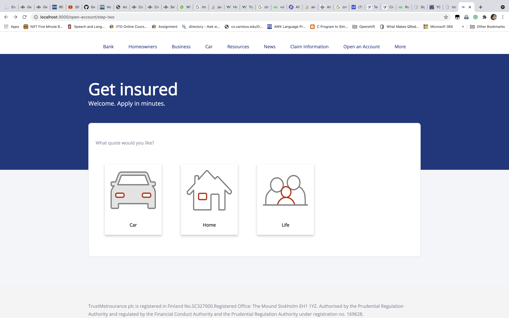   
   3. Click on Access your account to accept your quote -> Enter the email id and the temporary password sent to your email -> Click on login -> You will be asked to change the password -> Enter the new password.   
   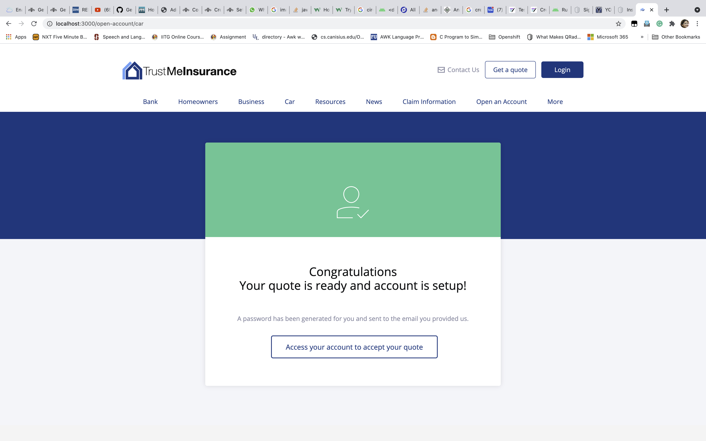

## Enroll Verify App as MFA

### Install IBM Security Verify app
Go [here](User_Mobile_Setup.md#install-ibm-security-verify-app-using-play-store) and follow the steps

### Configure IBM Security Verify app
1. After installing the app, Open the app -> Click on Connect an account.  
 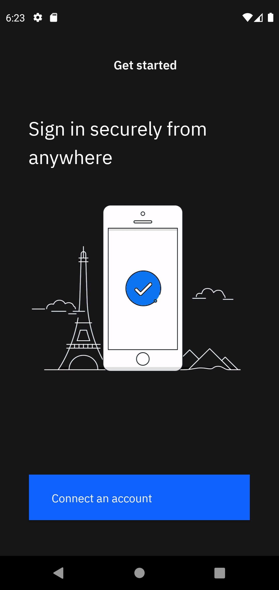  
2. Give permission to IBM Security Verify to access the camera ->  Allow Verify to take pictures and record video -> Select While using the app or Only this time.   
 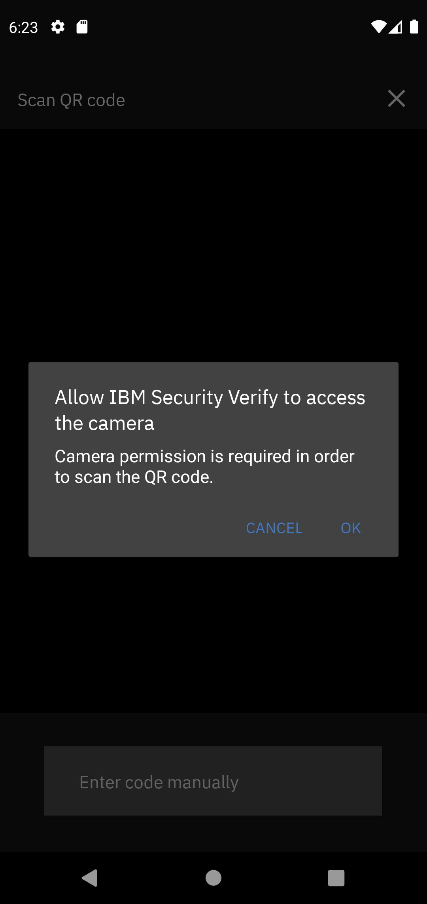 &nbsp; &nbsp; &nbsp;  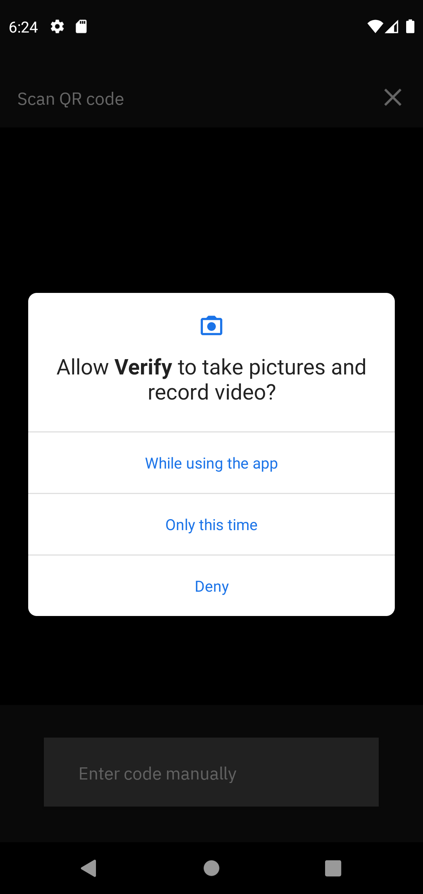    
3. Next you will see a QR code scanner.
4. For getting a QR code go to IBM Security Verify tenant. Click [here](#users-configuration) to create user at the tenant side.
5. Once the user is created go to the IBM Security Verify tenant. Login with the username and password.
6. After logging in -> Click on the circular icon to the top right showing the initials of the User -> Click on Profile & Settings.   
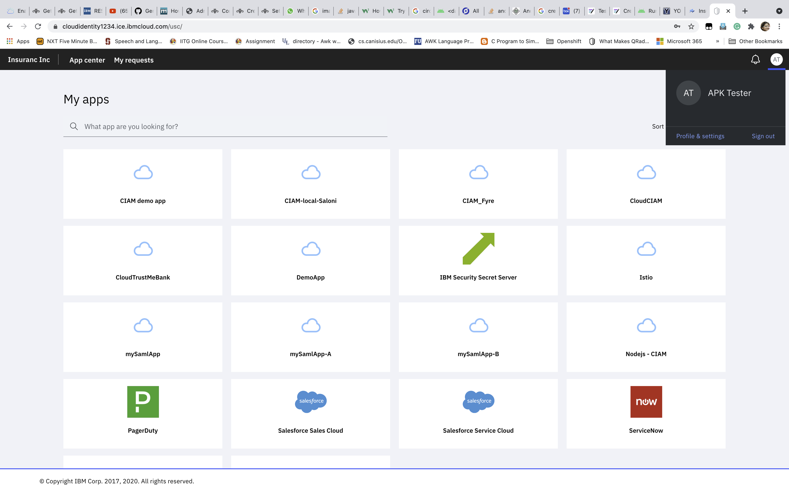  
7. Go to Security. You will be prompted for MFA -> Select the appropriate choice -> Enter the OTP -> Submit -> Click on Add new method.  
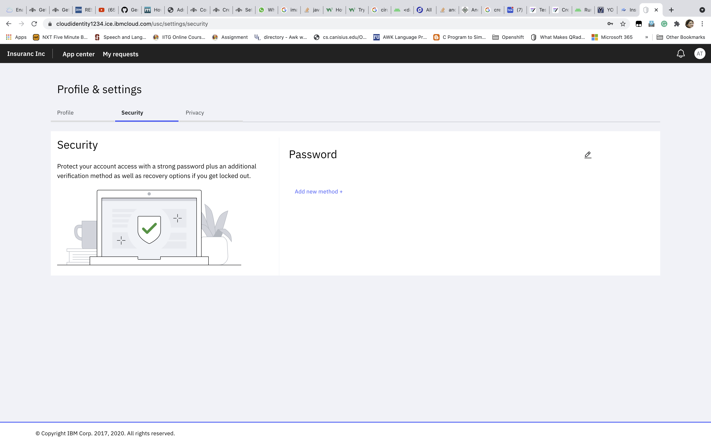  
8. Click on Add device next to IBM Security Verify app.  
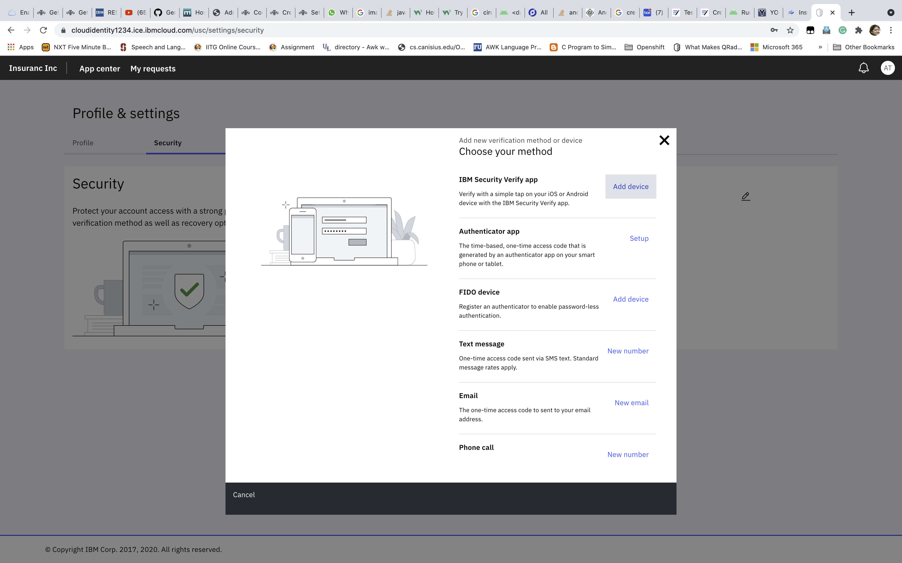  
9. Click on Connect your Account.  
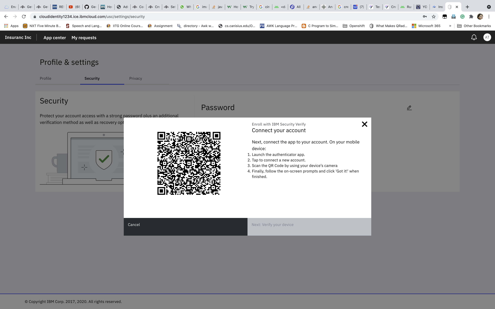  
10.  Scan the QR code from your Verify app -> You will be redirected to the following screen. You can use biometrics if you want.  
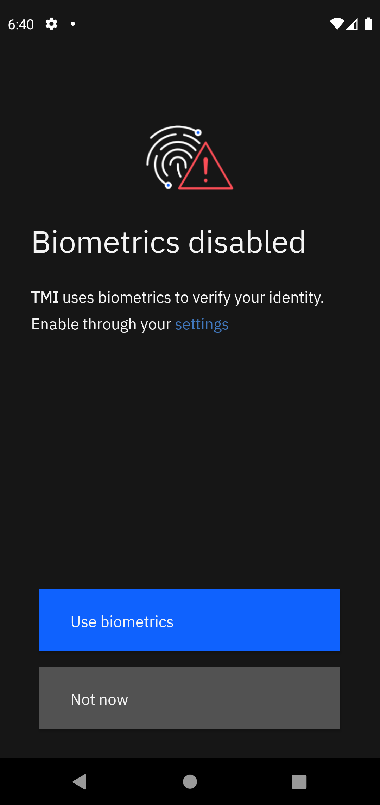  
11. Once you are done with the biometrics you will be taken to the next screen. Just click on Done and you can see your email id registered as MFA accounts.  
    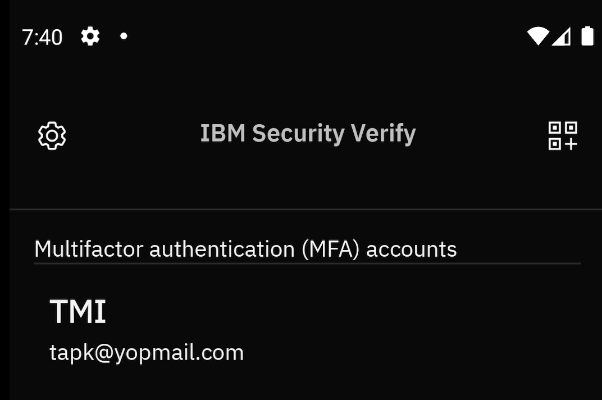

