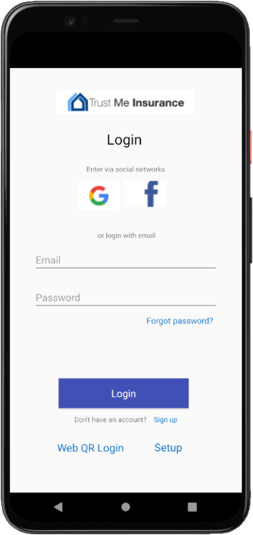
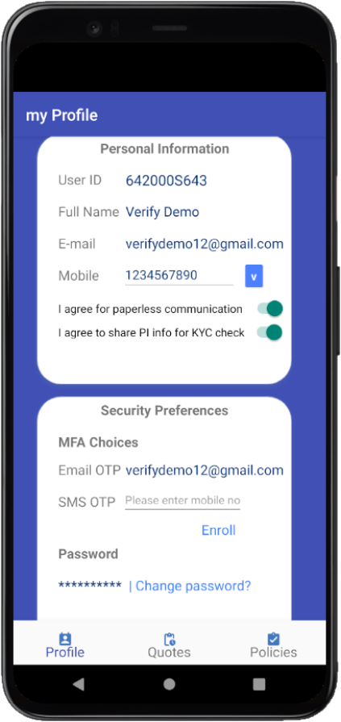
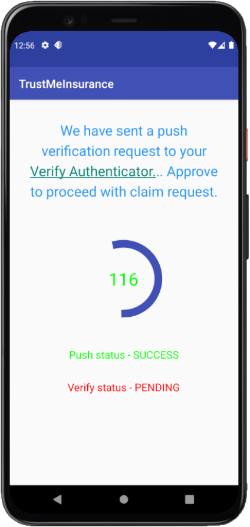

# Build a MobileApp using CIAM best practices for digital consumer identities
#### Creating an Andriod-based MobileApp to bring best Omni-Channel Consumer Experiences using IBM Secuirty Verify SDKs/APIs
###### by [Sivapatham Muthaiah](mailto:sivapatham@in.ibm.com) and [Saloni Rathi](mailto:saloni.deepak.kumar.rathi@ibm.com)

## Summary
This code-pattern will explain **CIAM (Consumer Identity and Access Management) Principles/Best practices** to develop an Android-based MobileApp and how **IBM Security Verify IDaaS SDK/APIs** help to adopt these best practices to create best *omni-channel consumer experiences* in Mobile and Web channels.

## Description
**CIAM - Consumer Identity and Access Management** is key focus area by many enterprises/brands in their digital transformation journey. Especially Mobile App is widely used digital channel to reach out different consumer bases in all industries. In MobileApp development, mobile developer needs to understand who is going to use the MobileApp and what kind of experiences users will go through.

* *Consumer Experience is the key to reduce app churn*

    MobileApp users act as a brand advocates and promote the business growth if in-app consumer experience is at its best and met their expectations

* *Security and Privacy is NOT optional!*

    Modern consumers assume the security and privacy of their PII data provided to brands. Brands have to ensure highest standards and compliance while capturing, storing and dealing with Consumer data in order to meet Privacy laws and regulations across globe.

**IBM Security Verify IDaaS**, being [market leader](https://securityintelligence.com/posts/ibm-named-ciam-leader-in-forrester-wave-report) in CIAM space, helps to develop best consumer experiences in consumer facing channel applications. **TrustMeInsurance** is considered as a sample consumer brand here which interacts with its consumers through Web and Mobile channels. Web channel sample code can be found [here](https://github.com/ajcase/ci-ciam) for reference. This code pattern explains *how-to* steps to adopt CIAM best practices and key principles in Mobile channel and also showcases how combined Web & Mobile apps bring *omni-channel consumer journey experience* by leveraging IBM Security Verify.

## Technologies
* Mobile Development
* Privacy
* Security IAM

## Pre-requisites
* IBM Security Verify IDaaS Tenant
* Android Studio IDE
* Mobile Phone OR Android Studio Emulator

## Flow


1. User installs *tmiMobileApp* and start using App with one or many of usecases listed below

   | Login  | Profile | Quote & Policy |
   |---|---|---|
   |Sign-up|Self care|Create a Quote|
   |(Social) Login|Consent recordings|Consent usage for PI data processing|
   |QR login|MFA enroll/de-enroll|Strong MFA - Push verfication|
   |Forgot passsword|Change password|---|
   ||||

2. *tmiMobileApp* uses Verify SDK/APIs to make calls to respective components in *IBM Security Verify IDaaS* platform to create the right consumer experience in given usecase flow.
3. User installs and registers *IBM Verify App* authenticator app as a MFA choice with Verify IDaaS and start using it to approve push verification requests.
4. *IBM Verify App* makes calls to registered Verify IDaaS to verify the push verification with or without TOTP or bio-metrics.

## Instructions
In this section, CIAM principles/best-practices are listed along with high-level steps to adopt in MobileApp.
To try out this code pattern, see the detailed technical steps in this [README.md](https://github.com/sivapatham/tmiMobileApp/blob/main/README.md).

#### (A) Silently registering consumer identity
To Know More on This CIAM Principle, [click here](https://www.ibm.com/security/digital-assets/iam/consumer-identity-and-access-management/#2-section)

>**Step 1** : Set up Android Studio with tmiMobileApp project; Follow the detailed instructions given [here](https://github.com/sivapatham/tmiMobileApp#developer)

>**Step 2** : Gather minimum information required like consumer's email-id to initiate brand journey like *Get a Instant Quote* flow in tmiMobileApp; Refer the [code](https://github.com/sivapatham/tmiMobileApp/blob/master/app/src/main/java/com/ibm/verifydemo/GetQuote.java) to capture the first-hand consumer info

>**Step 3** : Create a user account silently in Verify tenant and send an e-mail to Consumer about account creation and instructions to login to brand mobileapp/website; Refer the [code](https://github.com/sivapatham/tmiMobileApp/blob/master/app/src/main/java/com/ibm/verifydemo/CarQuoteDetails.java#L303) to create a User in Verify tenant.

>**Step 4** : Run the emulator to launch the app to see this Usecase working; [Click here](https://github.com/sivapatham/tmiMobileApp/blob/main/docs/Running_Demo.md) to know how to launch emulator

#### (B) Progressively profiling consumer data along with Consents
To Know More on This CIAM Principle, [click here](https://www.ibm.com/security/digital-assets/iam/consumer-identity-and-access-management/#3-section)

>**Step 1** : Set up Android Studio with tmiMobileApp project; Follow the detailed instructions given [here](https://github.com/sivapatham/tmiMobileApp#developer)

>**Step 2** : Capture consumer's consent as and when his/her PII data is captured in the transaction flow; Refer the [code](https://github.com/sivapatham/tmiMobileApp/blob/master/app/src/main/java/com/ibm/verifydemo/HomeQuoteDetails.java) to see how Consents are captured along the way in *Get Home Quote* page

>**Step 3** : Provide options to modify the Consents through User Profile page. Refer the [code](https://github.com/sivapatham/tmiMobileApp/blob/master/app/src/main/java/com/ibm/verifydemo/HomeActivity.java) to manage the Consents.

>**Step 4** : Run the emulator to launch the app to see this Usecase working; [Click here](https://github.com/sivapatham/tmiMobileApp/blob/main/docs/Running_Demo.md) to know how to launch emulator

#### (C) Enabling Self serviceable MFA/Social login choices
To Know More on This CIAM Principle, [click here](https://www.ibm.com/security/digital-assets/iam/consumer-identity-and-access-management/#4-section)

>**Step 1** : Set up Android Studio with tmiMobileApp project; Follow the detailed instructions given [here](https://github.com/sivapatham/tmiMobileApp#developer)

>**Step 2** : Enable security preference options in User Profile page for consumers to enroll the MFA method(s) they prefer. Refer the sample [code](https://github.com/sivapatham/tmiMobileApp/blob/master/app/src/main/java/com/ibm/verifydemo/HomeActivity.java) to enroll MFA choices

>**Step 3** : Enable Social login with popular Social identify providers to provide frictionless consumer experience. Refer the sample [code](https://github.com/sivapatham/tmiMobileApp/blob/master/app/src/main/java/com/ibm/verifydemo/WebViewActivity.java) for the same.

>**Step 4** : Run the emulator to launch the app to see this Usecase working; [Click here](https://github.com/sivapatham/tmiMobileApp/blob/main/docs/Running_Demo.md) to know how to launch emulator

#### (D) Providing transparency in processing consumer's PII data
To Know More on This CIAM Principle, [click here](https://www.ibm.com/security/digital-assets/iam/consumer-identity-and-access-management/#3-section)

>**Step 1** : Set up Android Studio with tmiMobileApp project; Follow the detailed instructions given [here](https://github.com/sivapatham/tmiMobileApp#developer)

>**Step 2** : Apart from providing options to add/remove Consents, brand needs to provide greater transparency in dealing with PII data which will in-turn increase the Consumer's Trust level to newer height. Refer the sample [code](https://github.com/sivapatham/tmiMobileApp/blob/master/app/src/main/java/com/ibm/verifydemo/QuoteApproval.java) to show case transparency while processing PII data in *Policy Issuance* flow

>**Step 3** : Run the emulator to launch the app to see this Usecase working; [Click here](https://github.com/sivapatham/tmiMobileApp/blob/main/docs/Running_Demo.md) to know how to launch emulator

#### (E) Silently securing consumer's interactions by Adaptive access combined with Strong MFA authentication
To Know More on This CIAM Principle, [click here](https://www.ibm.com/security/digital-assets/iam/consumer-identity-and-access-management/#6-section)

>**Step 1** : Set up Android Studio with tmiMobileApp project; Follow the detailed instructions given [here](https://github.com/sivapatham/tmiMobileApp#developer)

>**Step 2** : Asking for additional authentication during critical business transaction is must. Refer the sample [code](https://github.com/sivapatham/tmiMobileApp/blob/master/app/src/main/java/com/ibm/verifydemo/ClaimRequestActivity.java) which leverages Push verification method through Verify Authenticator App as additional layer of security in *Claim Request* flow

>**Step 3** : Providing risk-based context-aware authentication is another key aspect in providing frictionless consumer experience. Refer the sample [code](https://github.com/IBM-Security/adaptive-sdk-android/tree/master/android/AdaptiveApp) here. *This feature is not implemented in tmiMobileApp*

>**Step 4** : Run the emulator to launch the app to see this Usecase working; [Click here](https://github.com/sivapatham/tmiMobileApp/blob/main/docs/Running_Demo.md) to know how to launch emulator


## Components and services
* Verify MobileApp SDKs
* Verify REST APIs
* Verify Authenticator MobileApp

## Related links
* [Demo Video](https://ibm.box.com/s/1tdt7jvkvgcpo840bdy0430lt2061qkw): Omni-channel Consumer Journey Demo
* [GitHub Repo](https://github.com/sivapatham/tmiMobileApp): tmiMobileApp - Sample Code Repo
* [GitHub Repo](https://github.com/IBM-Security/adaptive-sdk-android/tree/master/android/AdaptiveApp): Adaptive App - Sample Code Repo
* [CIAM blog](https://www.ibm.com/security/digital-assets/iam/consumer-identity-and-access-management) - CIAM Blog
* [CIAM articles](https://securityintelligence.com/series/consumer-identity-access-management/#articles) - CIAM Series

## License

The contents of this repository are open-source under the Apache 2.0
licence.

```
Copyright 2020 International Business Machines

Licensed under the Apache License, Version 2.0 (the "License");
you may not use this file except in compliance with the License.
You may obtain a copy of the License at

    http://www.apache.org/licenses/LICENSE-2.0

Unless required by applicable law or agreed to in writing, software
distributed under the License is distributed on an "AS IS" BASIS,
WITHOUT WARRANTIES OR CONDITIONS OF ANY KIND, either express or implied.
See the License for the specific language governing permissions and
limitations under the License.
```
